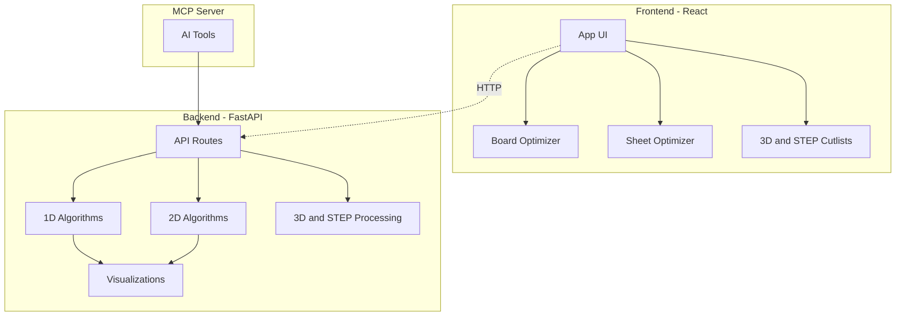

# Planqer

Planqer is a self-hosted cutting optimization platform for woodworking and
fabrication projects.
It turns part lists or CAD files into practical cutting plans, with kerf-aware
calculations, visual diagrams, and local project storage.

[](LICENSE)
[](
docker-compose.yml)
[](backend/pyproject.toml)
[](frontend/package.json)
[](backend/planqer/api.py)

📖 **[Read the full documentation](https://borkempire.github.io/planqer/)** —
getting started, per-tool guides, configuration reference, and troubleshooting.

## Why Planqer

- Self-hosted and private: your projects stay on your own machine or server.
- Practical optimization: accounts for kerf and material constraints.
- Multiple workflows: 1D boards, 2D sheets, STL cutlists, and STEP cutlists.
- API and AI ready: REST API plus MCP server integration.

## Key Features

### Optimization

- 1D board cutting with kerf compensation.
- 2D sheet optimization with optional part rotation.
- Multiple sheet strategies, including auto-selection.
- Waste and efficiency reporting in every result.

### Inputs and Outputs

- Manual part entry for board and sheet jobs.
- CAD-assisted workflow: STL upload (`/api/3d-cutlist`).
- CAD-assisted workflow: STEP/STP upload (`/api/step-cutlist`).
- Visual cut diagrams for implementation in the workshop.

### Project Management

- Local accounts on your own instance.
- Save and organize projects/groups.
- Day and night UI modes.

### Integrations

- FastAPI backend with OpenAPI docs.
- MCP server tools for AI assistants
  (Claude Desktop and compatible clients).

## Architecture



## Quick Start (Recommended)

Planqer is officially supported via Docker Compose.

### Prerequisites

- Docker
- Docker Compose

### Run locally

```bash
git clone https://github.com/borkempire/planqer.git
cd planqer
docker-compose up --build
```

Open:

- Frontend: <http://localhost:3000>
- Backend API docs: <http://localhost:8002/docs>
- Health endpoint: <http://localhost:8002/health>

Notes:

- The first account created becomes admin for that instance.
- Data is persisted in the Docker volume `backend_data`.

## Configuration

Localhost works without extra configuration. For hosted or proxied setups,
configure environment variables in `.env` next to `docker-compose.yml`.

### Common variables

```bash
# Backend
SECRET_KEY=<random-32-byte-hex>
PLANQER_CORS_ORIGINS=https://planqer.example.com,https://cuts.example.com

# Frontend
PLANQER_HOST=planqer.example.com
VITE_API_URL=https://planqer.example.com

# MCP server (container default points to backend service)
PLANQER_API_URL=http://backend:8002/api
```

Guidance:

- Keep `SECRET_KEY` stable across restarts to preserve login sessions.
- Set `PLANQER_HOST` when serving behind a reverse proxy to avoid blocked host
  checks.
- Set `VITE_API_URL` only when API discovery cannot be inferred from
  deployment shape.

## API Overview

Base route when accessed through the app/proxy: `/api`

### 1D board cutting

`POST /api/cutting-plans`

```json
{
  "parts": {"270": 4, "179": 8, "90": 16, "81": 4},
  "available_board_lengths": [300, 360, 500],
  "saw_blade_width": 3,
  "project_name": "Kitchen Shelves"
}
```

### 2D sheet optimization

`POST /api/sheet-optimization`

```json
{
  "parts": [
    {"width": 800, "height": 400, "quantity": 2, "name": "Top"},
    {"width": 300, "height": 400, "quantity": 4, "name": "Leg"}
  ],
  "sheet_width": 1220,
  "sheet_height": 2440,
  "kerf_width": 3,
  "allow_rotation": true,
  "project_name": "Dining Table"
}
```

### CAD cutlists

- `POST /api/3d-cutlist` for STL uploads.
- `POST /api/step-cutlist` for STEP/STP uploads.

## MCP Server (AI Integration)

Planqer includes an MCP server in `mcp-server/` with tools such as:

- `optimize_cutting`
- `optimize_demo`
- `get_demo_payloads`
- `get_cutting_example`

### Claude Desktop example

```json
{
  "mcpServers": {
    "planqer-cutting-optimizer": {
      "command": "uv",
      "args": [
        "--directory",
        "/path/to/planqer/mcp-server",
        "run",
        "planqer-mcp-server"
      ]
    }
  }
}
```

## Development Setup

Use this only if you want to contribute or run services directly from source.

### Backend (development)

```bash
cd backend
uv sync
uv run pytest
uv run uvicorn planqer.api:app --reload --host 0.0.0.0 --port 8002
```

### Frontend (development)

```bash
cd frontend
npm install
npm run dev
npm run build
npm test
npm run test:e2e
```

### MCP server

```bash
cd mcp-server
uv sync
npm install
npm run build
uv run planqer-mcp-server
```

### Documentation site

```bash
pip install -r docs/requirements.txt
mkdocs serve
```

Deployed automatically to GitHub Pages on push to `main` (see
`.github/workflows/docs.yml`).

## Testing

### Backend tests

```bash
cd backend
uv run pytest
uv run pytest --cov=planqer
```

### Frontend tests

```bash
cd frontend
npm run test:e2e
```

### API health

```bash
curl <http://localhost:8002/health>
```

## Project Structure

```text
planqer/
  backend/        FastAPI app, optimization logic, tests
  frontend/       React app, UI components, e2e tests
  mcp-server/     MCP integration for AI assistants
  docs/           MkDocs Material documentation site (mkdocs.yml at the repo root)
  docker-compose.yml
```

## Contributing

Contributions are welcome.

### Typical workflow

1. Fork the repository.
2. Create a feature branch.
3. Add or update tests with your change.
4. Run relevant test suites.
5. Open a pull request with a clear description.

### Contribution expectations

- Keep changes scoped and focused.
- Follow existing project style and patterns.
- Update documentation when behavior changes.
- Prefer factual claims backed by tests or reproducible runs.

## Security

If you discover a security issue, please open a private report if possible
before public disclosure.

## License

MIT License. See [LICENSE](LICENSE).

## Support

- Open an issue for bugs or feature requests.
- Include reproduction steps, payload samples, and environment details when relevant.
