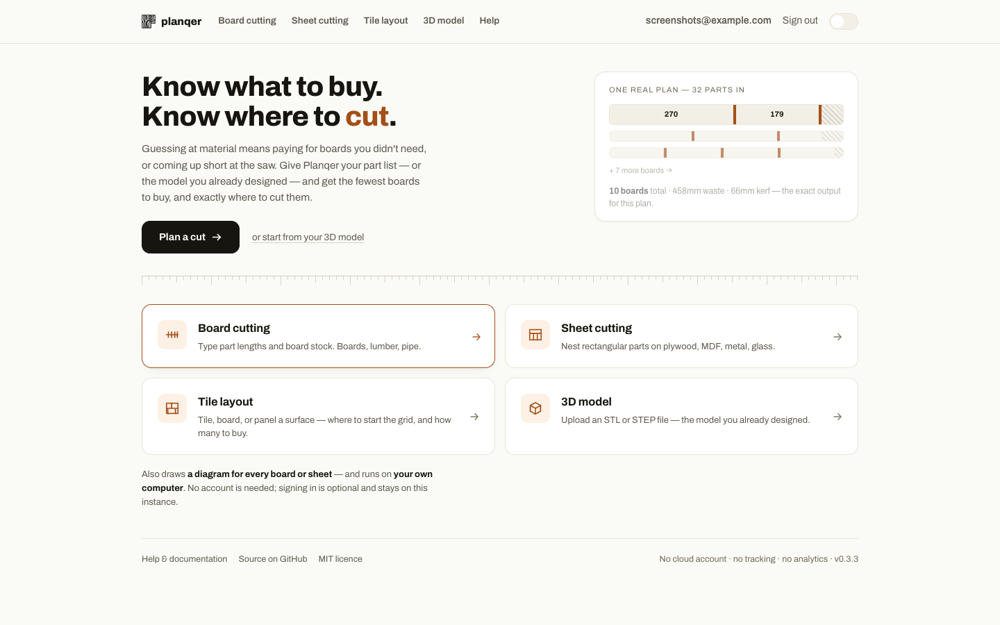
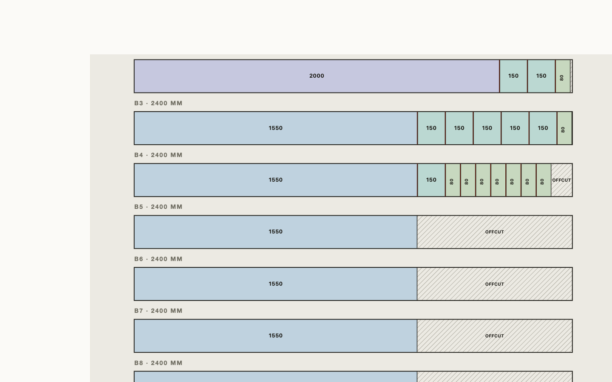
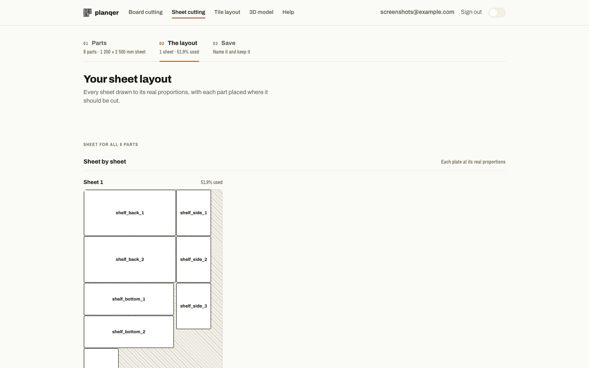
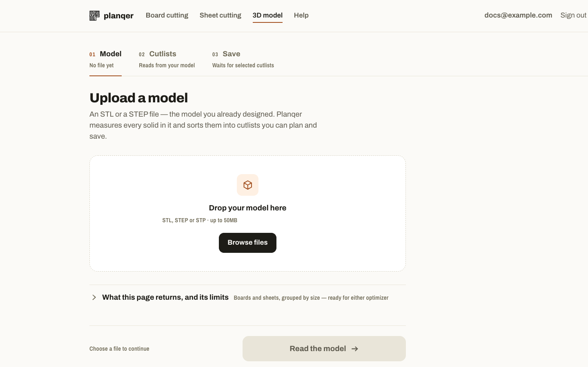
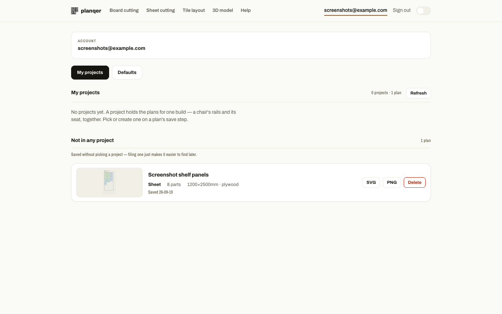

# Planqer

Planqer is a self-hosted cutting optimization platform for woodworking and fabrication projects.
It turns part lists or CAD files (STL/STEP) into practical, kerf-aware cutting plans with visual diagrams and local project storage.

[](LICENSE)
[](docker-compose.yml)
[](backend/pyproject.toml)
[](frontend/package.json)

---

## Features

- **1D Board & 2D Sheet Cutting**: Kerf compensation, part rotation, and waste efficiency calculations.
- **CAD File Support**: Upload STL or STEP files to automatically generate cutlists.
- **Self-Hosted & Private**: Local accounts and data stay entirely on your server.
- **AI Assistant Integration**: Includes an MCP (Model Context Protocol) server for Claude Desktop and compatible clients.

---



<table>
<tr>
<td width="25%"><a href="docs/assets/screenshots/board-cutting-result.png"></a><br><sub>Board cutting</sub></td>
<td width="25%"><a href="docs/assets/screenshots/sheet-cutting-result.png"></a><br><sub>Sheet cutting</sub></td>
<td width="25%"><a href="docs/assets/screenshots/model-cutlist.png"></a><br><sub>3D model → cutlist</sub></td>
<td width="25%"><a href="docs/assets/screenshots/dashboard.png"></a><br><sub>Saved projects</sub></td>
</tr>
</table>

---

## Quick Start

The easiest way to run Planqer is with Docker Compose. Two ways to do it:

- **Pull published images (recommended)** — uses `docker-compose.release.yml`,
  published images from GitHub Container Registry, no build step. Defaults to
  `latest`; set `PLANQER_VERSION` to pin a specific release:

  ```bash
  curl -O https://raw.githubusercontent.com/nordstad/Planqer/main/docker-compose.release.yml
  docker compose -f docker-compose.release.yml up -d
  ```

  Works with no further setup for `localhost`. To customize anything (pin a
  version, allow a LAN/DNS address, set a stable `SECRET_KEY`), fetch
  [`.env.example`](.env.example) and rename it to `.env` in the same
  directory — Compose reads it automatically:

  ```bash
  curl -o .env https://raw.githubusercontent.com/nordstad/Planqer/main/.env.example
  ```

  See [Configuration](docs/reference/configuration.md) for what each variable does.

- **Build from source** — uses `docker-compose.yml`:

  ```bash
  git clone https://github.com/nordstad/Planqer.git
  cd planqer
  docker compose up -d --build
  ```

Once started, open:

- **Frontend**: <http://localhost:3001>
- **Backend API Docs**: <http://localhost:8002/docs>
- **Health Check**: <http://localhost:8002/health>

*Note: The first account created on a fresh instance becomes the administrator.*

*Accessing Planqer from another device on your network (e.g. `http://192.168.1.50:3001`)
instead of `localhost`? Set `PLANQER_CORS_ORIGINS` to that address before starting, or
sign-in and registration will silently fail as CORS-blocked requests:*

```bash
PLANQER_CORS_ORIGINS=http://192.168.1.50:3001 docker compose up -d --build
```

---

## Documentation

Detailed guides, configuration options, API references, and MCP server setup instructions are available in the documentation site.

📖 **[Read the Documentation](https://nordstad.github.io/Planqer/)**

> **Note**: The GitHub Pages documentation link above will be live once the repository is made public. To preview the docs locally:
>
> ```bash
> pip install -r docs/requirements.txt
> mkdocs serve
> ```

---

## License

[MIT](LICENSE)
