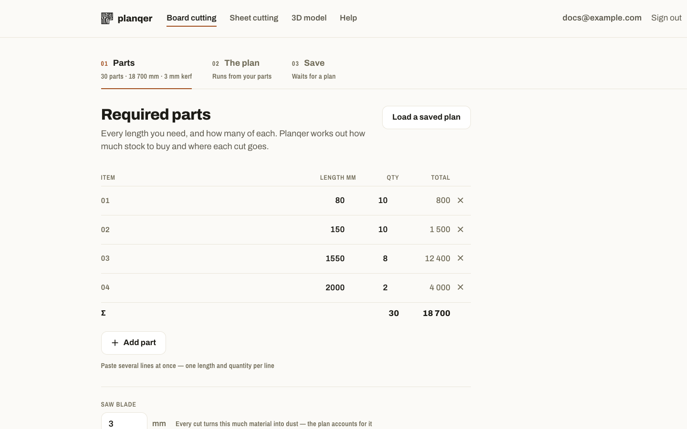

# Board cutting

For boards, lumber, trim, pipe — anything cut to length from a single
dimension. Route: `/cutting`.

## Inputs

| Field | What it means |
| --- | --- |
| **Required parts** | Every length you need, and how many of each, in millimetres. |
| **Saw blade (kerf)** | The material each cut turns into dust. Every result subtracts it. |
| **Stock available** | The lengths your supplier actually sells — not what you need. |

You can type parts one row at a time, or paste several lines at once (one
length and quantity per line).

## Running the plan

Click **Plan the cuts**. Planqer packs your parts onto the fewest boards it
can from the stock lengths you gave it, and returns:

- The number of boards required, and which stock length each one is.
- A cutting diagram, drawn to one scale, with every board's cuts in order.
- The cut order for each board — read this off at the saw.
- Material bought, offcut, blade waste, and efficiency.

!!! warning "No board is long enough for the largest part"
    This means your longest part is longer than every stock length you
    offered. Add a longer stock length, or split the part.

## Saving a plan

Once you have a result, **Name and save** keeps it on your instance under
your account — organized into a project if you like — so you can open it
again later from any browser signed into the same instance.

## Cost analysis

Expand **Cost analysis** on the result page to price your stock (per length
or per metre) and see the total cost of the plan, including bulk pricing
where it applies.

## Limits

- Part and board length: up to 6000 mm (configurable via
  `backend/config.yaml`, see [Configuration](../reference/configuration.md)).
- Up to 1000 parts per request, 1000 quantity per part.
- Optimization is heuristic, not proven-optimal — a good plan, not a
  guaranteed minimum.
