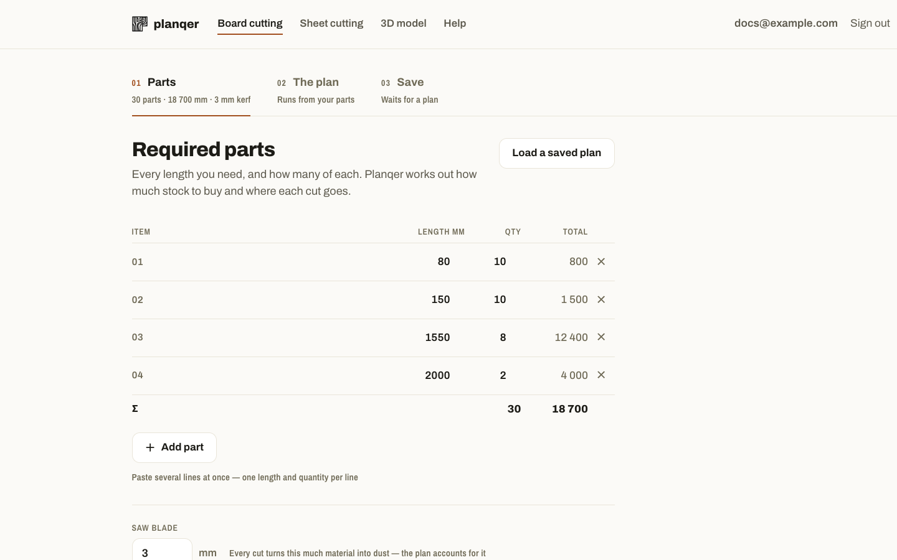
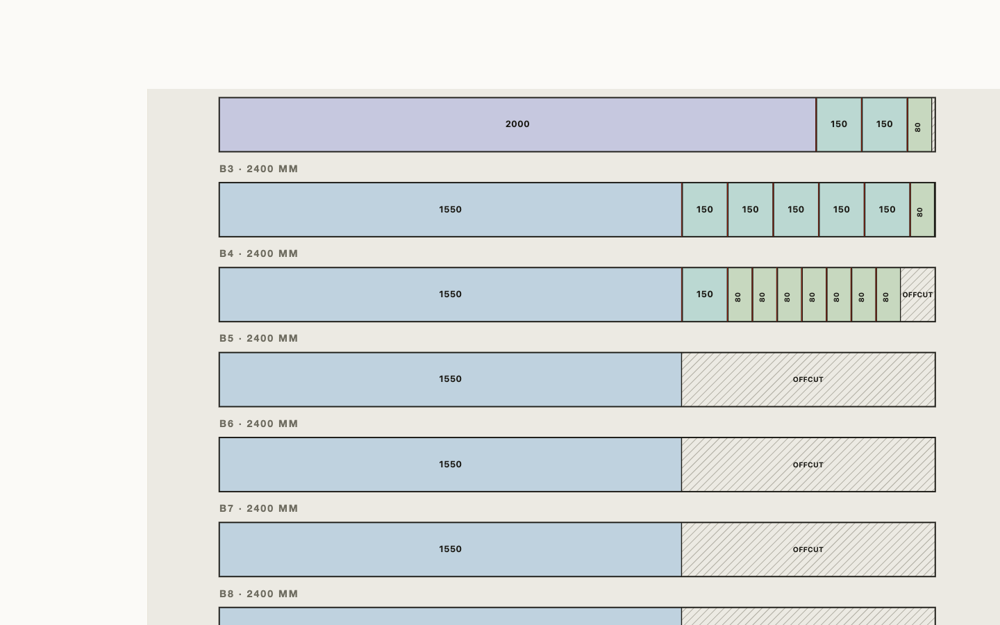

# Board cutting

For boards, lumber, trim, pipe — anything cut to length from a single
dimension. Route: `/cutting`.

## Inputs

| Field | What it means |
| --- | --- |
| **Required parts** | Every length you need, and how many of each, in millimetres. |
| **Saw blade (kerf)** | The material each cut turns into dust. Every result subtracts it. |
| **Stock available** | The lengths your supplier actually sells — not what you need. |
| **Product** | Optional. What you are buying: search the catalogue by name or size (`regel 45x95`), or type your own words. See [Choosing a product](#choosing-a-product). |

You can type parts one row at a time, or paste several lines at once (one
length and quantity per line).

## Choosing a product

Planning never needs a product, only the board's thickness and width. If you
want the plan to say what you are buying, use the **Product** search:

- Type a name (*regel*, *trall*, *glulam*), a size (*45x95*, *45 × 95*), or both.
  Names work in English, Swedish and Norwegian.
- Pick a result, or **Use “…” as my own product** to keep your own words.
- A product offers its own thickness and width, and its standard stock lengths,
  as buttons. Nothing is filled in until you press one.
- **Details** (species, treatment, grade, surface, a note) are optional and stay
  folded away until you want them.

The catalogue is set per instance — see
[Configuration](../reference/configuration.md#product-catalogue). When a plan is
saved, the product is copied into it, so a later catalogue update never changes
an old plan.

## Running the plan

Click **Plan the cuts**. Planqer packs your parts onto the fewest boards it
can from the stock lengths you gave it, and returns:

- The number of boards required, and which stock length each one is.
- A cutting diagram, drawn to one scale, with every board's cuts in order.
- The cut order for each board — read this off at the saw.
- Material bought, offcut, blade waste, and efficiency.

!!! warning "No board is long enough for the largest part"
    This means your longest part is longer than every stock length you
    offered. Add a longer stock length, or split the part.

## Saving a plan

Once you have a result, **Name and save** keeps it on your instance under
your account — organized into a project if you like — so you can open it
again later from any browser signed into the same instance.

## Cost analysis

Expand **Cost analysis** on the result page to price your stock (per length
or per metre) and see the total cost of the plan, including bulk pricing
where it applies.

## Limits

- Part and board length: up to 15 000 mm.
- Up to 1000 parts per request, 1000 quantity per part.
- Optimization is heuristic, not proven-optimal — a good plan, not a
  guaranteed minimum.
