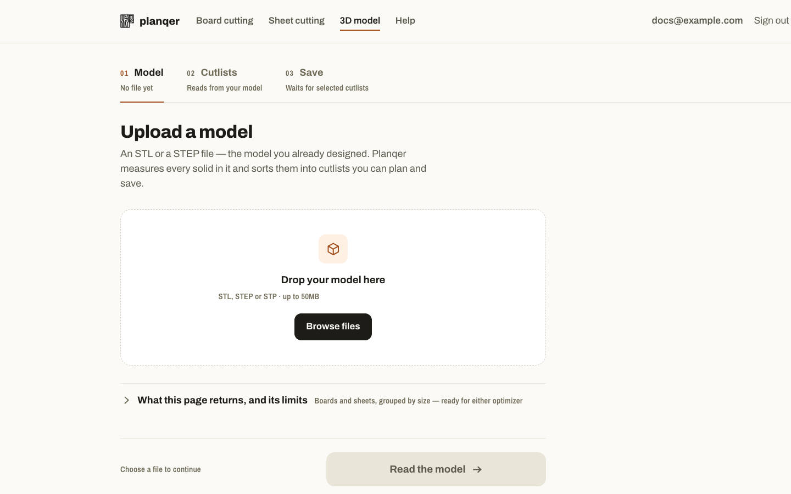

# 3D model / STEP cutlists

Start from the model you already designed instead of typing a part list.
Route: `/model-cutlist`.

## Supported files

| Format | What you get |
| --- | --- |
| **STL** | Every solid in the file, split out and measured. |
| **STEP / STP** | The same, plus real component names, materials, and assembly hierarchy — because STEP carries that metadata and STL doesn't. |

Files up to 50 MB. Planqer works in millimetres; the file's own declared unit
is used if it has one.

## Workflow

1. Drop or browse to your file and click **Read the model**.
2. Planqer measures every solid, classifies each as a board-shaped or
   sheet-shaped part, and groups them into cutlists by size.
3. Review the cutlists. For each one you can rename it, choose a product
   (or leave it empty), and expand the list of lengths or sizes it contains.
   Untick any you don't want. Planqer matches each measured cross-section to the
   catalogue (within 1 mm) and pre-selects the common match, marked
   **Suggested** until you press **Looks right** or change it. A product you
   choose is remembered for that cross-section next time.

   A STEP file's own material names are read the same way. Names such as
   `C24`, `Furu`, `OSB/3` or `Birch plywood` are looked up among the catalogue's
   type names and aliases, species, treatments, profiles and grades, in any of
   Planqer's languages and regardless of case or spacing, so equivalent names
   (`C24`, `c24`) end up in one cutlist rather than two. When the name says what
   the product is (a type or a grade), exactly one product type fits it at the
   measured size, and nothing in it is ambiguous, the product is selected and
   marked **From model**. Anything weaker, such as a species alone or a size
   the type doesn't come in, is still offered but marked **Suggested**, and a
   name the catalogue doesn't know stays your own words. Either way you can
   review and change it.
4. Either hand one cutlist off on its own with **Plan alone** — the parts and
   the chosen product arrive pre-filled on the [board](board-cutting.md) or
   [sheet](sheet-cutting.md) page — or plan the selected cutlists together.
5. On the save step every cutlist has its own stock lengths (or sheet size) —
   the chosen product can offer its standard lengths or sheet sizes —
   cut width and optional prices. **Apply to all board groups** and **Apply to
   all sheet groups** copy one cutlist's stock, cut width and prices to the
   others. Prices are never required: without them a cutlist is planned for
   the least waste; with a price on every length (or the sheet) the saved
   plan carries its cost.
6. Pick or create a project — a new project is pre-named after the model file —
   and save. A link takes you straight to that project.

!!! note "Uploading doesn't need an account"
    Reading and extracting a model works without signing in. Planning and
    saving the resulting cutlist does.

## Limits

- Up to 50 MB per file.
- Splitting relies on the model being composed of separate solids/bodies —
  a single fused solid won't be split into its logical parts.
