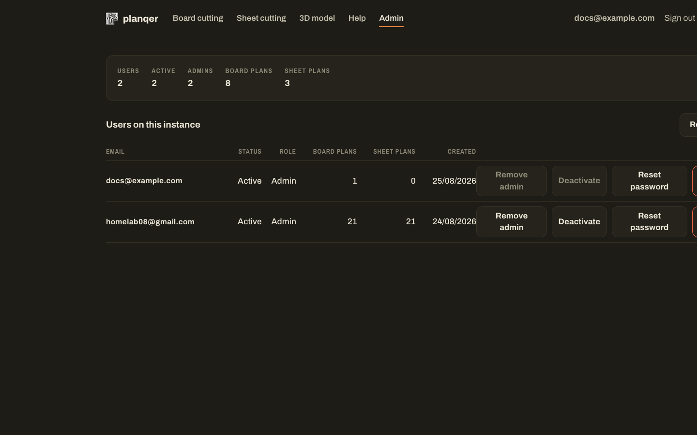

# Projects & accounts

## Local accounts

Planning and saving a cutlist requires a **local account on your own
instance** — never a cloud account. Nothing is sent anywhere else. The first
account created on a fresh instance becomes its admin.

Uploading and reading a 3D model (`/model-cutlist`) does **not** require an
account; only planning and saving a cutlist does.

## Dashboard

Your dashboard (`/dashboard`) lists everything you've saved, optionally
grouped into projects — so a chair's rails and its seat can live together.


- **Projects** group related plans; a plan can also be left unfiled.
- Each saved plan shows its type (board/sheet), part count, the stock/kerf it
  used, and when it was saved.
- Download the diagram again as SVG or PNG, or delete the plan.

## Admin panel

Admins get an **Admin** link in the navigation, leading to `/admin`: a list of
every user on the instance, with per-user actions.



From there an admin can, per user:

- Promote/demote admin status
- Activate/deactivate the account
- **Reset the account's password** (prompts for a new one)
- Delete the account

An admin cannot deactivate, demote, or delete their own account from this
panel — that button is disabled for your own row.

## There is no self-service "forgot password"

Planqer does not send email, so there is no password-reset link in the sign-in
form. If you forget your password:

- **Someone else is an admin on the instance:** ask them to reset it from
  the Admin panel above.
- **You're the only admin and you're locked out:** use the `create_admin.py`
  script on the host, from outside the app:

  ```bash
  docker exec -it planqer-web-backend uv run python create_admin.py set-password <email>
  ```

  This is the supported recovery path — it prompts for a new password
  on the terminal and writes it directly to the database. It does not go
  through the web UI, so it works even if you can't sign in at all.

See `backend/create_admin.py --help` (or `python create_admin.py help` if
running from source) for the full set of admin-management commands,
including creating or promoting a user non-interactively.
